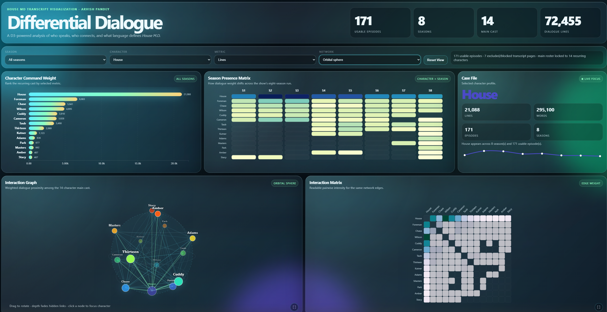
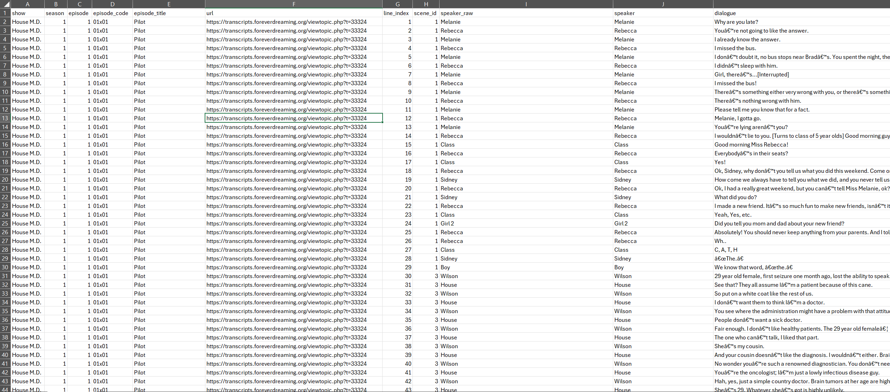
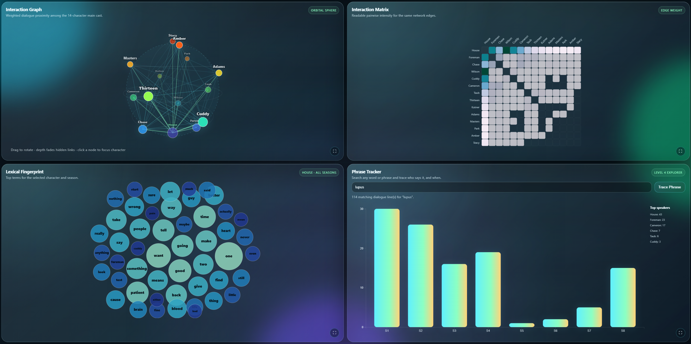

# Differential Dialogue: A House M.D. Character Intelligence Console

**Project 3: House MD Transcript Analysis and Visualization Console**  
**Student:** Arvish Pandey
**Team:** Individual Project  
**Live Application:** [Live Demo](https://differentialdialogue-p3.netlify.app/)  
**Code Repository:** [GitHub Repository](https://github.com/arvish/data_viz_project3)  
**Demo Video:** <!-- [2–3 Minute Demo Video](PASTE_VIDEO_LINK_HERE) -->


## Preview Image



---

## 1. Motivation

This project began with a simple interest: I wanted to analyze a show that had enough transcript data to support a serious visualization, but I also wanted the subject to mean something to me. I chose **House M.D.** because I have been a long-time admirer of Hugh Laurie’s work. I followed his art from his British comedy era, including **Jeeves and Wooster** and **Blackadder**, to his transformation into Dr. Gregory House. That range has always fascinated me. House is sharp, wounded, funny, abrasive, brilliant, and often unbearable. As a character, he gives a transcript analysis project a strong center of gravity.

The application is designed to help a viewer understand the character structure of **House M.D.** through dialogue. It asks questions such as:

- Who speaks the most across the show?
- Which characters dominate different seasons?
- How do the main characters interact with each other?
- What words define a selected character’s dialogue?
- How does a phrase such as `lupus`, `pain`, or `cancer`(Wilson or House?) appear across seasons?

The goal was to build a **diagnostic console for dialogue**. The application treats the show like a textual system. Each speaker becomes a signal. Each season becomes a timeline. Each interaction becomes a weighted connection.

The final result is **Differential Dialogue**, a D3-powered character intelligence dashboard for **House M.D.**

---

## 2. Data

### Data source

The transcript data came from **Forever Dreaming Transcripts**, which hosts episode transcript pages for **House M.D.**

**Source:**  
[House M.D. Forever Dreaming Transcript Index](https://transcripts.foreverdreaming.org/viewforum.php?f=890)

The project originally explored multiple shows and sources. Some shows had transcripts but did not label who was speaking. That made them unusable for a character-centered analysis. The selected House M.D. source was useful because most episode pages included speaker tags, such as:

```text
House: ...
Wilson: ...
Cuddy: ...
Foreman: ...
```

This was essential because the project required analysis of who speaks, how much they speak, what they say, and who they appear to interact with.

### Data coverage

The final dataset includes:

- **171 usable episodes**
- **8 seasons**
- **14 main recurring characters**
- **72,455 parsed dialogue lines**
- **6 skipped transcript pages**
- **1 excluded blocked/challenge page**

The final main-character roster used in the dashboard is:

```text
House
Foreman
Chase
Wilson
Cuddy
Cameron
Taub
Thirteen
Kutner
Adams
Masters
Park
Amber
Stacy
```

These characters were selected because they represent the recurring cast structure across the show. Generic speaker labels, such as `Patient`, `Nurse`, `Mom`, `Dad`, or `Surgeon`, were preserved in the raw data but excluded from the main dashboard roster.

### Data collection and preprocessing

The preprocessing work was a major part of this project.

The transcript index was spread across multiple listing pages. I first created an episode manifest from those listing pages. The manifest included:

```text
season
episode
episode_code
episode_title
url
local_filename
```

The site served a JavaScript anti-bot challenge to Python requests, so automatic downloading was not reliable. Because of that, episode HTML files were saved manually through the browser and matched to the local filenames in the manifest. This avoided polluting the dataset with challenge/loading pages.

The preprocessing pipeline then:

1. Read the episode manifest.
2. Loaded each local episode HTML file.
3. Extracted the transcript content.
4. Detected speaker-tagged dialogue lines.
5. Skipped pages with missing or unreliable speaker tags.
6. Normalized speaker-name variants.
7. Created summary files for the frontend.
8. Created text-frequency and network-edge files.

Speaker normalization was necessary because the transcripts used inconsistent casing and aliases. For example:

```text
House
HOUSE
GREG HOUSE
```

were normalized to:

```text
House
```

The same approach was used for other characters, such as Wilson, Foreman, Cuddy, Taub, Kutner, Amber, and others.

### Generated data files

The frontend uses derived CSV files rather than processing raw HTML in the browser. Important files include:

```text
major_characters.csv
character_summary.csv
character_season_summary.csv
character_episode_summary.csv
episode_summary.csv
speaker_edges_major.csv
character_words_top50_by_season.csv
dialogue_lines.csv
episode_parse_report.csv
notable_secondary_characters.csv
speaker_alias_audit.csv
```

The preprocessing script also produces an episode parse report, which makes the exclusions transparent. This was important because some transcript pages did not contain reliable speaker tags. Those episodes were excluded rather than guessed.


## Data Screenshot



---

## 3. Visualization Components

The application is built as a single-page interactive dashboard. The visual style is based on my previous Project 2 dashboard. I reused that project as a design foundation, especially the liquid-glass panels, translucent cards, dark console background, gradient lighting, and full-viewport layout. The goal was to keep the professional “instrument panel” feel from Project 2, but adapt it to a medical-diagnostic theme.

The interface has a global control ribbon and multiple linked views. Changing the selected season, character, metric, or network mode updates the relevant views.


## Full Dashboard Screenshot



### 3.1 Global Overview and Controls

At the top of the interface, summary cards show the project scale:

- usable episodes
- seasons
- main cast count
- dialogue lines

Below that, the control ribbon allows the user to select:

- Season
- Character
- Metric
- Network mode

The selected character and season become global state. Other views respond to those selections.

The interface also includes a data-quality note showing how many transcript pages were usable versus excluded. I included this because the data was scraped and processed from inconsistent pages, so the project should be honest about its source limitations.

---

### 3.2 Character Command Weight

This ranked bar chart shows which main characters are most important according to the selected metric.

Available metrics include:

- dialogue lines
- words spoken
- episode appearances

The bar chart is useful because ranking is one of the clearest ways to compare character importance. House dominates the show, but the supporting structure becomes more interesting after filtering by season.

Interactions:

- Hovering shows exact values.
- Clicking a character changes the selected character globally.
- Changing the metric updates the ranking.
- Changing the season filters the ranking to that season.

Design justification:

A bar chart was the best choice here because the task is direct comparison. The viewer needs to quickly answer who speaks more and by how much.

---

### 3.3 Season Presence Matrix

The season matrix is a character-by-season heatmap. Rows represent the 14 main characters. Columns represent seasons 1 through 8. The color intensity represents the selected metric.

This view makes cast changes visible. It shows when characters enter, fade, disappear, or become more central.

Interactions:

- Hovering shows the selected character, season, and metric values.
- Clicking a season-character cell focuses that character and season.
- The heatmap responds to the selected metric.

Design justification:

A heatmap was chosen because it is compact and good for comparing two categorical dimensions at once. In this case, those dimensions are character and season. It also reveals structural shifts in the show more effectively than a long table.

---

### 3.4 Case File

The Case File panel shows a focused profile for the selected character. It includes:

- total lines
- total words
- episode count
- season count
- a small season trend sparkline

This panel acts as the dashboard’s detail-on-demand area. It gives the selected character more context without forcing the user to leave the main view.

Interactions:

- Updates when the selected character changes.
- Updates when a season is selected.
- Shows the character’s seasonal pattern through a compact line chart.

Design justification:

The case-file metaphor fits the House M.D. theme. It also gives the dashboard a narrative anchor. The user is not only looking at charts, they are inspecting a character record.

---

### 3.5 Interaction Graph

The interaction graph shows weighted dialogue proximity among the 14-character main cast. The network is built from adjacent or nearby speaker relationships in the transcript. It is not a perfect scene-level social network, because the transcripts did not consistently provide structured scene metadata. Instead, it approximates interaction strength by examining dialogue proximity.

The graph supports multiple modes:

```text
Force Graph
Orbital Sphere
Interaction Matrix
Both
```

#### Force Graph

The force graph places characters as nodes and draws weighted links between them. Larger or thicker links indicate stronger interaction weight.

Interactions:

- Hovering on a node shows network weight.
- Hovering on an edge shows the connected characters and interaction weight.
- Clicking a node selects that character globally.
- Season filtering updates the network.

Design justification:

A force-directed graph is a natural encoding for relational data. It is visually expressive and makes dominant relationships clear, especially around House.

#### Orbital Sphere

The orbital view is a pseudo-3D D3/SVG network sphere. It can be dragged and rotated like a globe. Nodes and links fade or scale based on depth.

This view was added as an advanced exploratory mode. It helps reduce the flat “spiderweb” feeling of the normal network and creates a more inspectable, dimensional view of the character graph.

Interactions:

- Drag to rotate.
- Hover nodes and links for details.
- Click nodes to focus a character.
- Use the expand button for a larger view.

Design justification:

The orbital mode is intentionally more experimental. The matrix remains the precise analytical view. The force graph remains the standard network view. The orbital sphere adds a more interactive way to explore the same network without relying on extra frameworks or WebGL libraries.

---

### 3.6 Interaction Matrix

The interaction matrix shows the same relationship data as the network graph, but in a more readable grid format. Rows and columns are the 14 main characters. Cell intensity represents weighted interaction strength.

Interactions:

- Hovering shows the character pair and weight.
- Clicking a cell focuses a character.
- Season filtering updates the matrix.

Design justification:

Networks can look impressive, but they can also become visually tangled. The matrix is included as the serious analytical companion to the graph. It makes pairwise comparisons easier and prevents the project from relying only on a decorative network visualization.

---

### 3.7 Lexical Fingerprint

The lexical fingerprint shows the selected character’s most frequent words as a bubble cloud. The bubbles scale by frequency.

Interactions:

- Character selection updates the word cloud.
- Season selection filters the words to that season.
- Hovering over a word shows its count.
- The expand button opens a larger view.

Design justification:

The project required a visualization designed for text data. A word cloud is a familiar option, but I wanted a slightly more controlled version. The bubble layout keeps the visual expressive while still making frequency visible through area. It also matches the liquid-glass dashboard style better than a basic rectangular word cloud.

---

### 3.8 Phrase Tracker

The phrase tracker lets the user search for a word or phrase and see when it appears across the show. For example:

```text
lupus
pain
cancer
everybody lies
diagnosis
```

The tracker shows:

- number of matching dialogue lines
- season-level frequency
- top main-cast speakers for the searched phrase

Interactions:

- Type a word or phrase.
- Press Enter or click Trace Phrase.
- Hover on bars to inspect season counts.
- Use the expand button for a larger view.

Design justification:

This feature extends the project beyond static text summaries. It lets the user ask their own question of the transcript corpus. It also directly supports the assignment’s suggestion to search for words or phrases and examine when they appear or disappear across the show.

---

### 3.9 Expandable Views

The four lower visual panels include expand buttons:

- Interaction Graph
- Interaction Matrix
- Lexical Fingerprint
- Phrase Tracker

Clicking the expand button opens a larger liquid-glass popout. The background mildly blurs and the selected visualization redraws at a larger size.

This was added because some views are dense. A network graph, matrix, word bubble layout, or phrase timeline can benefit from more space, especially on larger screens.

---

## 4. Design Sketches and Design Justifications

The project design follows a console layout inspired by Project 2. I wanted the interface to feel like a polished instrument panel rather than a set of disconnected charts. The final design uses a dark medical-console aesthetic with translucent glass cards, cyan and green gradients, soft glow effects, and compact analytical panels.

The intended layout was:

```text
Top:
- title, project identity, summary metrics

Control ribbon:
- season, character, metric, network mode

Main analysis row:
- character ranking
- season heatmap
- selected character case file

Relationship row:
- interaction graph
- interaction matrix

Language row:
- lexical fingerprint
- phrase tracker
```

This structure supports a layered reading of the show:

1. First, understand overall character importance.
2. Then, inspect how importance changes by season.
3. Then, focus on a character.
4. Then, examine their relationships.
5. Finally, inspect their language and recurring phrases.

The design choices were intentional:

- **Bar chart** for ranking and comparison.
- **Heatmap** for character-season change.
- **Profile card** for detail-on-demand.
- **Force graph** for relational structure.
- **Matrix** for readable pairwise comparison.
- **Bubble word view** for text-specific encoding.
- **Phrase tracker** for exploratory text search.
- **Orbital view** for advanced interactive inspection of network density.

---

## 5. Findings and Discoveries

The application enables several useful discoveries about House M.D.

### 5.1 House dominates the dialogue system

The most obvious finding is that House is not just the main character narratively. He is also the dominant speaker in the transcript data. His line count is far above every other character.

This fits the structure of the show. House drives the diagnostic process, the conflict, and much of the humor. The data makes that dominance visible.

### 5.2 The early team structure is clearly visible

The season matrix shows the early diagnostic team: House, Foreman, Chase, Cameron, Wilson, and Cuddy. Their presence is strongest in the early seasons, with later changes visible as the team evolves.

Cameron’s pattern is especially useful because her prominence is not evenly distributed across all seasons. The heatmap helps show that shift without needing to read episode summaries manually.

### 5.3 Later-season characters enter as visible blocks

Characters such as Taub, Thirteen, Kutner, Masters, Adams, and Park appear as later blocks in the matrix. This is one of the strongest uses of the heatmap. It turns cast turnover into a visual pattern.

The dashboard makes it easy to see that the show is not static. Its character system changes as the diagnostic team changes.

### 5.4 House is the network center

The interaction graph and matrix show House as the central hub. Most major characters have strong interaction edges with him. This is expected, but the visualization shows how strongly the dialogue network is organized around him.

The matrix also makes it easier to compare secondary relationships, such as House-Wilson, House-Cuddy, House-Foreman, and team interactions.

### 5.5 Phrase search reveals thematic movement

The phrase tracker allows the user to search for medical, emotional, or recurring thematic terms. Searching terms such as `lupus`, `pain`, or `cancer` reveals which seasons and characters carry those terms most often.

This makes the application more exploratory. Instead of only showing predefined findings, it lets the user test their own curiosity against the transcript data.

---

## 6. Process, Tools, and Code Structure

### Libraries and technologies

The application uses:

```text
HTML
CSS
JavaScript
D3.js v7
Python
BeautifulSoup
pandas
```

Python was used for preprocessing because the raw transcript pages required scraping, parsing, speaker cleanup, and summary generation before they could be visualized.

### Code structure

The project is organized around a preprocessing pipeline and a static frontend.

Suggested structure:

```text
DataViz_P3/
  index.html
  style.css
  js/
    main.js
  data/
    major_characters.csv
    character_summary.csv
    character_season_summary.csv
    character_episode_summary.csv
    episode_summary.csv
    speaker_edges_major.csv
    character_words_top50_by_season.csv
    dialogue_lines.csv
    episode_parse_report.csv
  scripts/
    house_pipeline.py
  raw/
    index/
    episodes/
```

---

## 7. Limitations and Future Work

The largest limitation is that the transcripts did not always include reliable scene boundaries. Because of that, the interaction network uses dialogue proximity as an approximation rather than perfect scene co-presence.

Some transcript pages also lacked speaker tags or were blocked by a challenge page. These pages were excluded rather than guessed. This keeps the analysis cleaner, but it means the dataset is not a perfect 178-episode corpus.

Future improvements could include:

- More advanced phrase extraction.
- Sentiment analysis by character and season.
- Better scene detection using stage directions.
- Character-pair language analysis.
- A dedicated view for patient or case-of-the-week characters.
- A comparison between early and late diagnostic teams.
- More refined stop-word and medical-term handling.

---

## 8. Final Reflection

This project became more than a transcript exercise. It became a way to study a show through structure. House M.D. is built around diagnosis, conflict, and language. That made it a strong subject for a data visualization project.

The final dashboard lets the viewer move from character importance, to seasonal change, to network structure, to language patterns. It also keeps the visual identity intentional: dark, glassy, clinical, and analytical.

The result is a public-facing application that reflects both the assignment requirements and my own interest in Hugh Laurie’s work, performance, and character craft.
